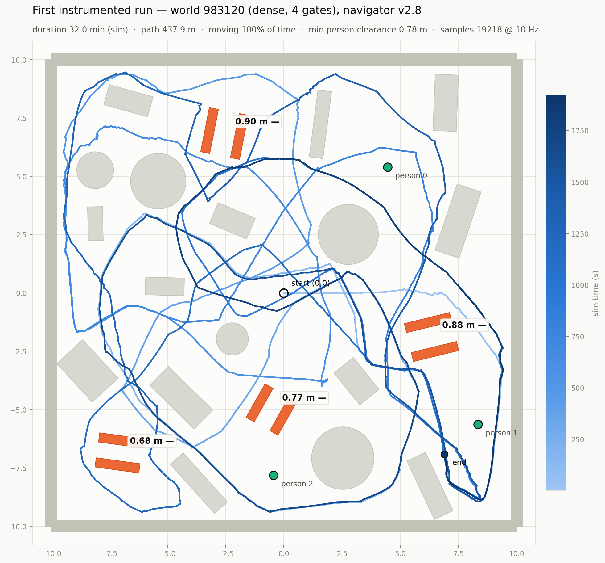
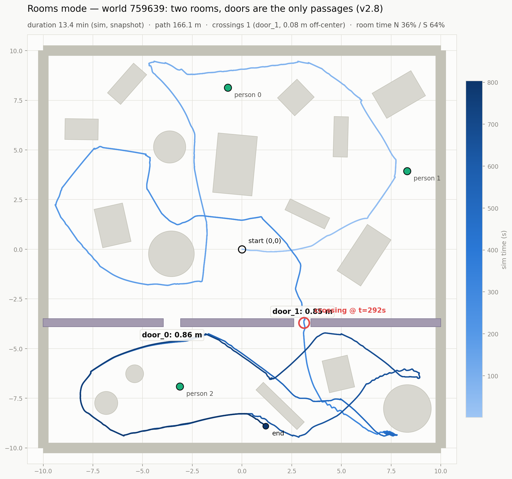
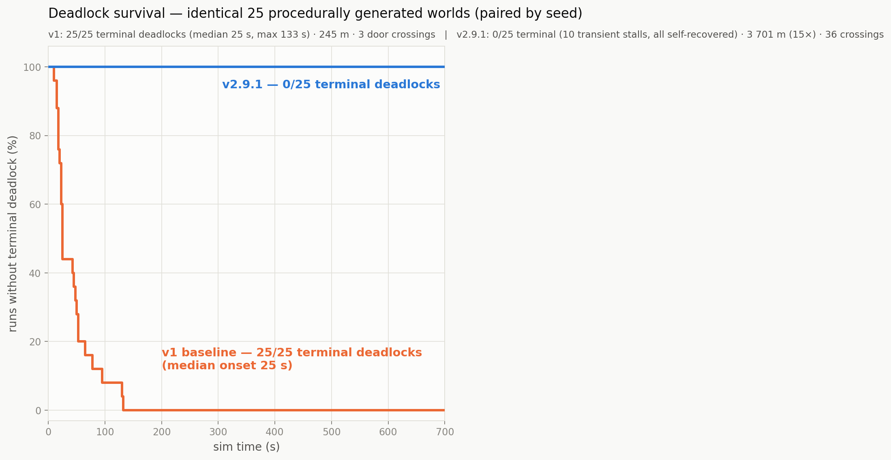
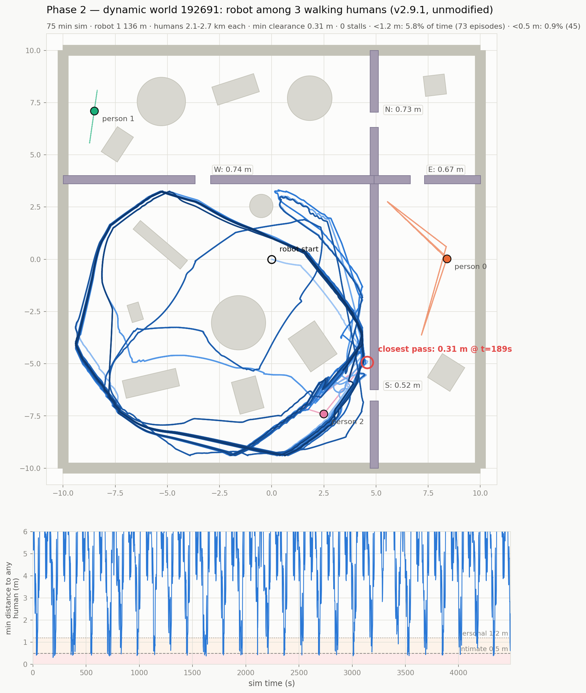
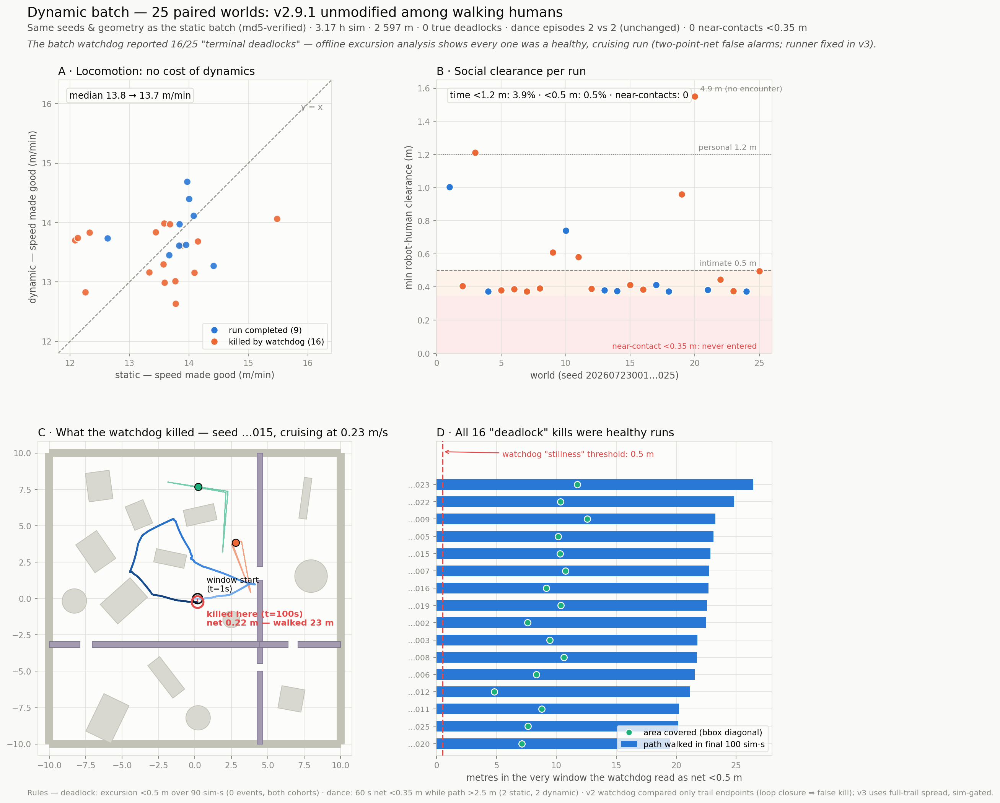
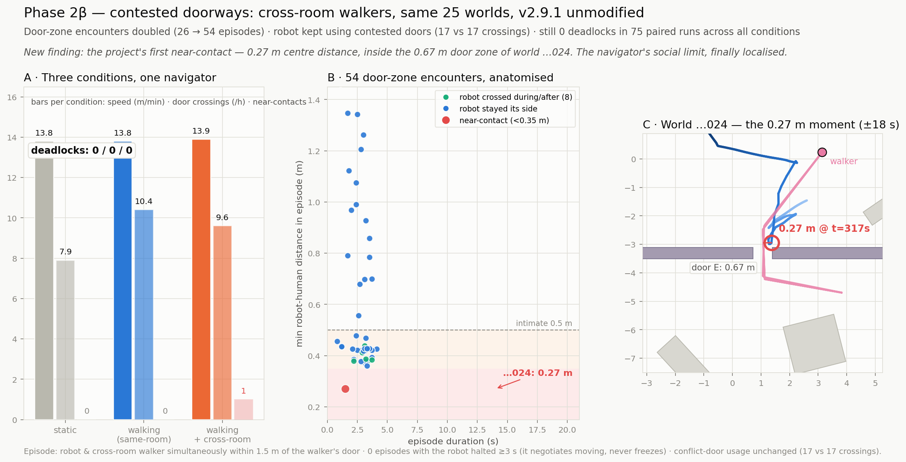
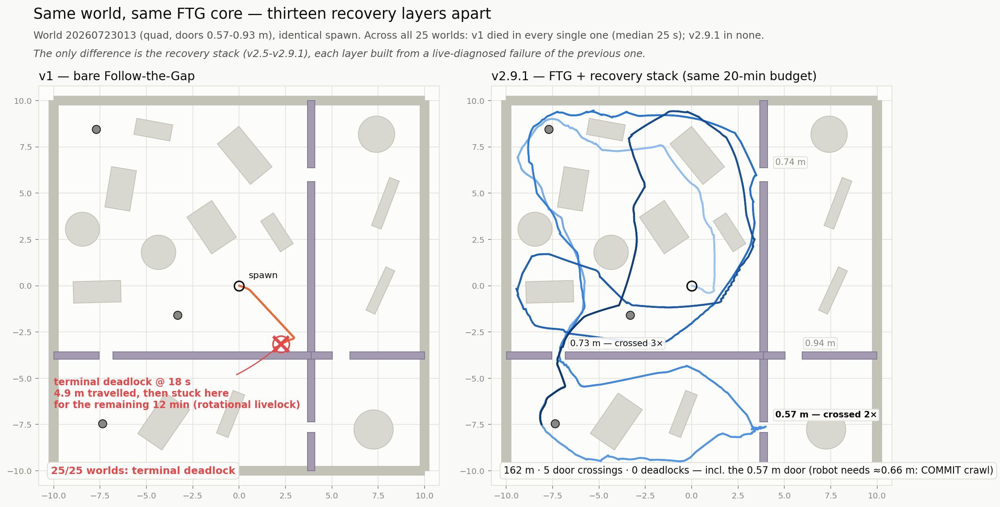
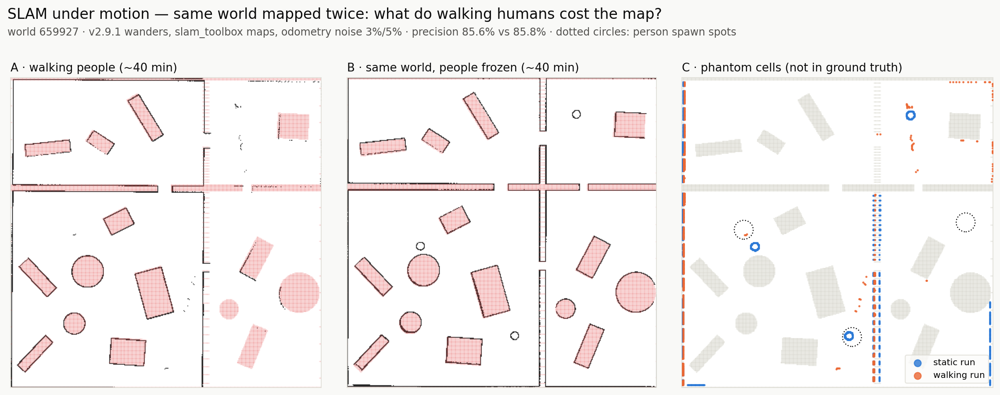
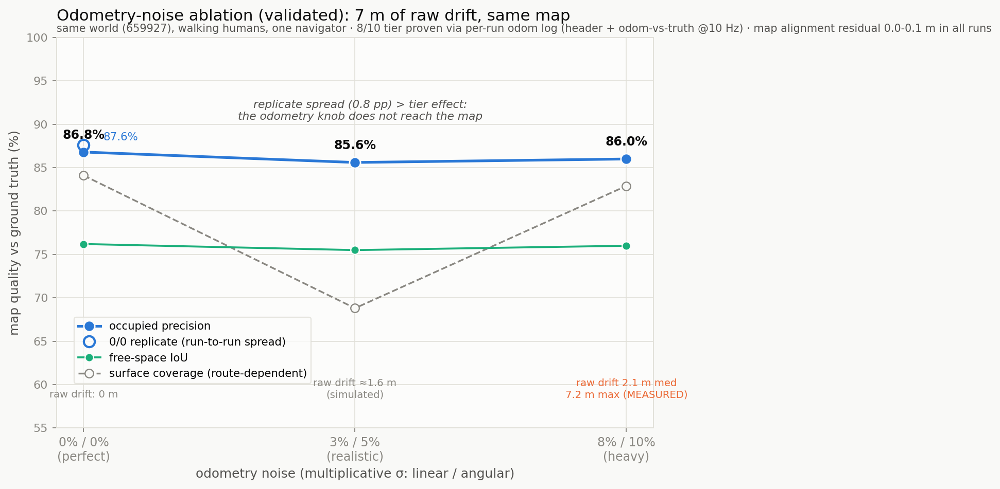
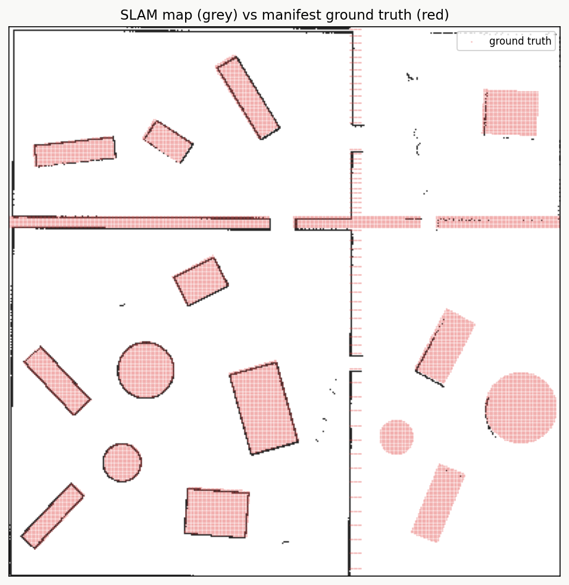

# All figures

Every figure produced during the project, in experiment order, with what it shows
and which script regenerates it. The four headline figures also appear in the
README. The rest document intermediate findings and diagnostic work.

## The simulator

**The robot and a walker.** A path-traced frame from one of the generated worlds:
the 0.42 m platform face to face with one of the people it navigates around.
The people are unanimated meshes moved along scripted routes — a deliberate
choice: locomotion realism costs GPU time on a below-spec card and adds nothing
at lidar scale, and the sensors see these meshes exactly as the navigator does.

## Early exploration

**Single-run trajectory, first multi-room world.** The reactive navigator's path
through a generated world — the raw material every later metric is computed from.
(`plot_run.py` family)

**Trajectory across rooms.** An early check that the navigator actually commits
to door crossings instead of orbiting one room.

## Experiment 1 — reactive navigation vs door width

**The success curve.** 25 worlds, 100 labeled doors. Success falls from
near-certain above 0.72 m to near-zero below 0.55 m. Dashed lines mark the
0.42 m body and the nominal minimum with sensor inflation. (`plot_curve.py`)

**Why version 2 exists.** The v1 baseline deadlocked in tight geometry. The v2
recovery layers finished every run. Same worlds, same seeds — only the navigator
changed. (`plot_compare.py`, stats from `compare_v1_v2.py`)

## Experiment 2 — the cost of walking people

**One social encounter, in full.** A single run with walkers: trajectory,
per-moment clearance to each person, and the navigator's mode timeline around
the encounters. The microscope view behind the aggregate numbers.
(`plot_dynamic.py`)

**The aggregate cost.** 25 paired worlds, static vs dynamic: exploration speed
unchanged, interaction pressure doubled. (`plot_cost_of_dynamics.py`)

**The final phase-2 figure.** Locomotion parity seed by seed, social clearance
floor at 0.38–0.45 m, door crossings by width, and the watchdog field test
(16 false kills before the fix, 0 after). (`plot_phase2_final.py`)

**Contested doorways.** What happens at doors specifically when a walker is
routed through the robot's preferred crossing: conflict episodes double.
(`plot_xroom.py`)

**Before and after, one world.** Seed 013 side by side: v1 dies in a pocket,
v2 escapes and keeps exploring. (`plot_before_after.py`)

## Experiment 3 — mapping while people walk

**The mapping batch.** All 25 worlds mapped autonomously in one night. Grey is
the mapped occupancy, red the manifest ground truth, and the label the
wall-surface coverage. Median 63%, range 47–92%. (`plot_slam_batch.py`)

**Walking vs standing people.** Walkers leave almost no imprint on the map.
A standing person imprints an order of magnitude more occupied cells.
(`compare_maps.py`)

**Odometry-noise ablation.** Three noise tiers (0/0, 3%/5%, 8%/10%): map quality
is nearly flat even at 7 m of raw drift — mapping here is exploration-limited,
not odometry-limited. (`plot_ablation.py`)

**Map-vs-truth evaluation, one world.** The evaluation overlay for a single map:
occupied precision, surface coverage, per-quadrant breakdown.
(`evaluate_map.py`)

## Experiments 4 and 5 — the localization tax

**The paired mission matrices.** 25 worlds × 4 goals, default AMCL (left) vs
sparse-map-tuned AMCL (right), every cell verified against ground truth.
Dotted cells: goals the offline reachability check calls infeasible on that
map. False arrivals 6 → 0, real arrivals 11 → 12, and all four predicted cage
worlds refused in both configurations. (`plot_paired_missions.py`)

