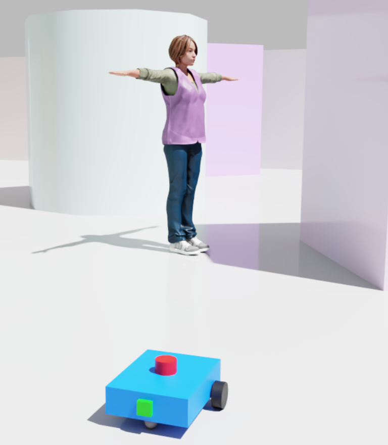
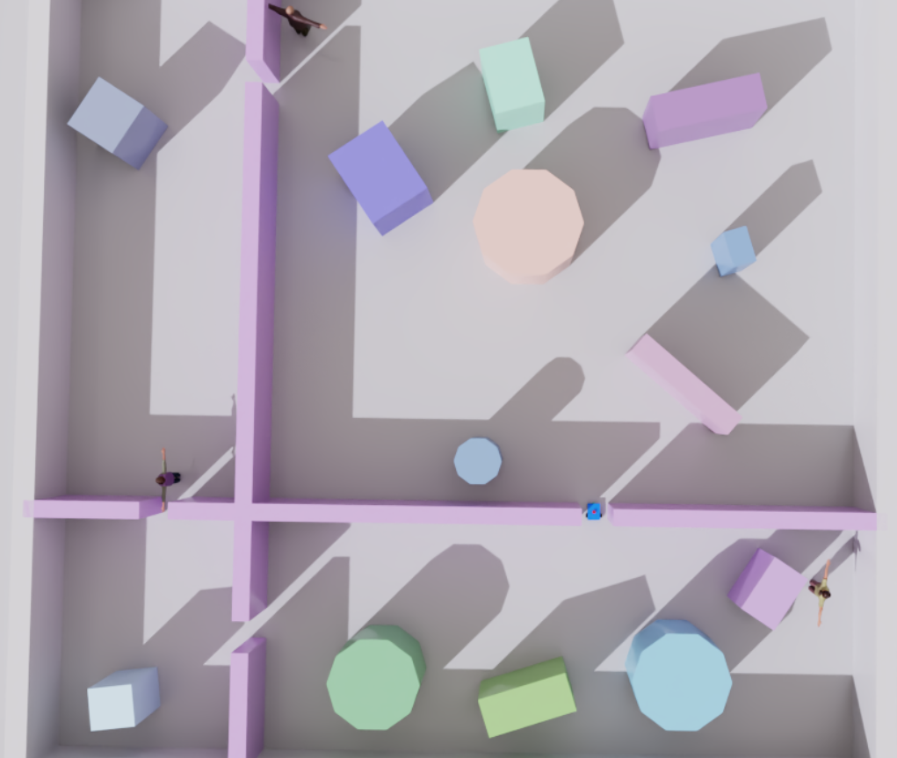
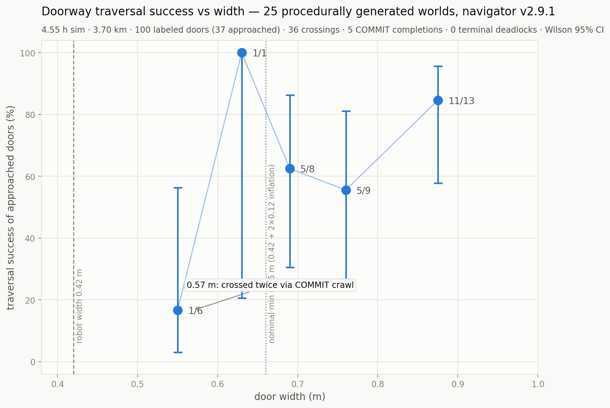
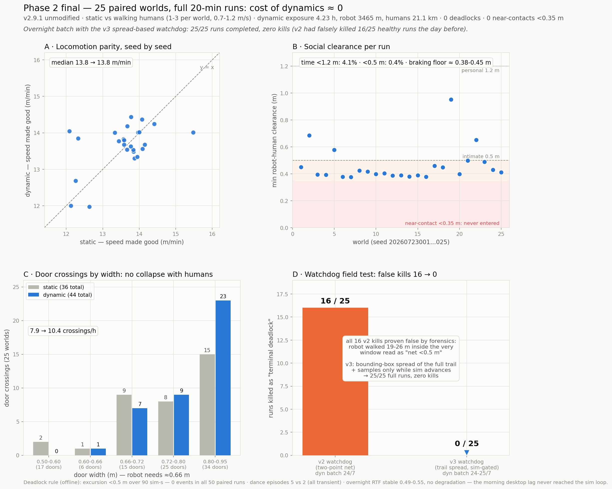
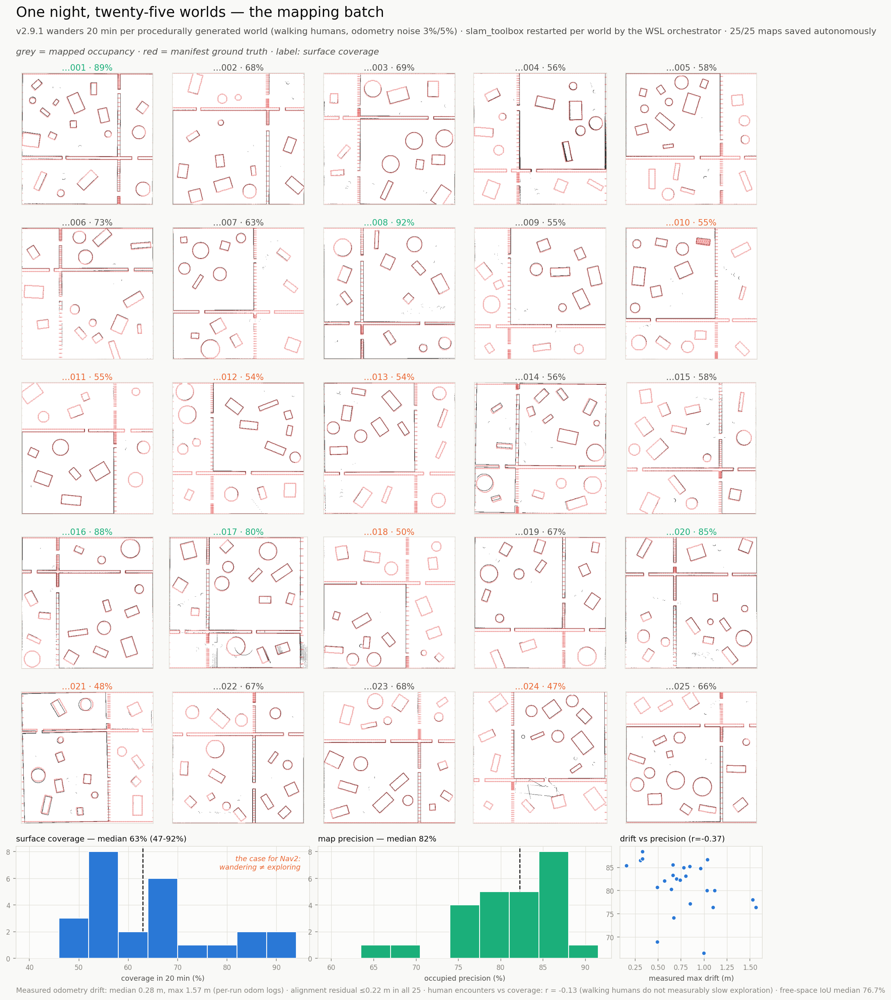
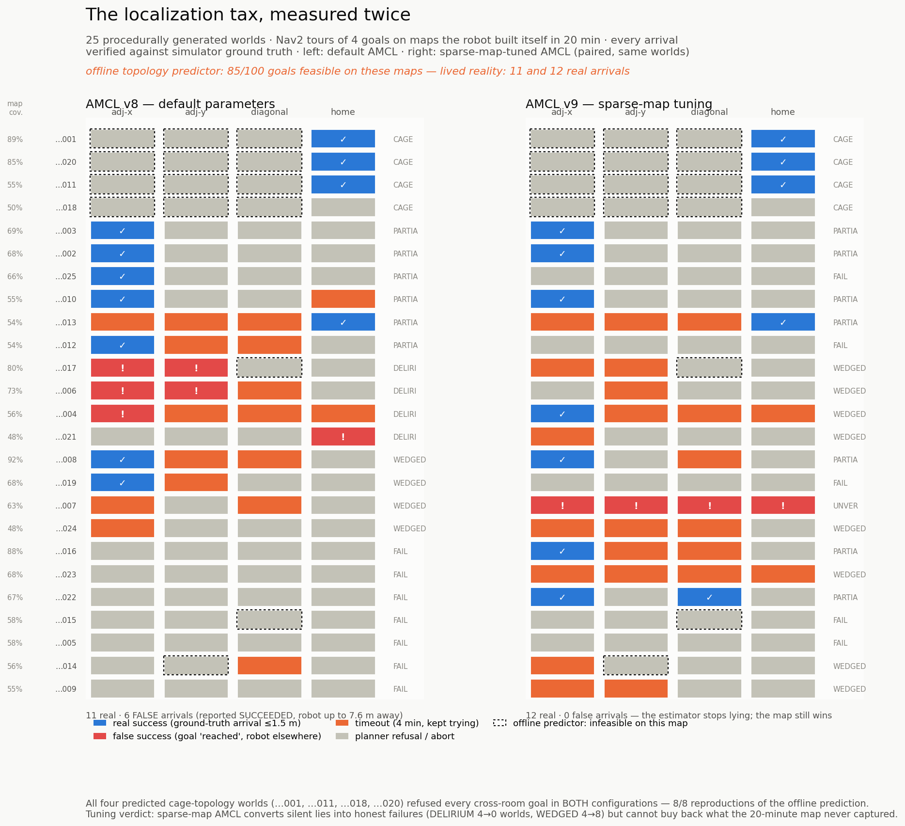

# Indoor navigation among walking people: a measured pipeline in Isaac Sim

This repository contains a simulation benchmark I built to answer one question in stages: what does it actually take for a wheeled robot to move with purpose through cluttered rooms while people walk around it?

Everything runs in NVIDIA Isaac Sim 6.0 with ROS 2 Jazzy on WSL2. The robot is a 0.42 m differential-drive platform with a 360-ray lidar and a camera. Worlds are generated procedurally from a seed: four rooms, doors of controlled width, random furniture, and up to three people who walk scripted patrol routes through doorways. Every claim below is checked against simulator ground truth, not against what the robot believes. The full pipeline ran on a single RTX 2080 Ti, below the simulator's minimum spec, at real-time factors between 0.35 and 0.55.

Author: Dimitrios Gkiokas — dimitris.gkiokas@outlook.com

Six-page technical report: [`report_gkiokas_2026.pdf`](report_gkiokas_2026.pdf) (also attached to [Release v1.0](../../releases/tag/v1.0)) · All figures with captions: [FIGURES.md](FIGURES.md)

<em>The robot and one of the walkers, path-traced in Isaac Sim. The people are unanimated meshes moved along scripted routes. The lidar and camera see them exactly as the navigator does.</em>

<em>One world from above, paused mid-run: four rooms, doors in the partition walls, seeded furniture, three walkers on their routes. The robot is mid-crossing in the central doorway.</em>

## Demo

https://github.com/user-attachments/assets/2eda9605-6167-463c-b3ef-dac336a959df

The reactive navigator coming through a doorway, recorded live in the simulator. The footage plays at 1.5× to offset the below-real-time simulation rate on this GPU. The clip also lives in the repository as [`demo.mp4`](demo.mp4).

## Results

Five experiments, each building on the previous one. All figures are produced by the scripts in this repository from the CSVs in `runs/`. The four below are the headlines. The complete set, with captions, is in [FIGURES.md](FIGURES.md).

**1. Reactive navigation vs door width**
25 seeded worlds, 20 minutes each. A follow-the-gap navigator with 13 recovery layers explores autonomously. Door traversal success falls from near-certain above 0.72 m to near-zero below 0.55 m. The transition band sits exactly where body diameter (0.42 m) plus sensing margin predicts it.

**2. The cost of walking people**
The same 25 worlds, run static, with 2 walkers, and with 3 walkers crossing rooms: 75 paired runs, zero deadlocks. Exploration speed is unchanged (13.8 vs 13.9 m/min). What changes is interaction pressure: door-conflict episodes double, and the single near-contact of the whole campaign happens at a door mouth, 0.27 m, when a walker emerges into the robot's blind frontal sector. The lidar reflex caught what the camera could not see.

**3. Mapping while people walk**
The robot maps each of the 25 worlds with slam_toolbox while odometry noise (3% linear, 5% angular, measured drift up to 1.57 m) and walking people are active. 25 of 25 maps saved autonomously overnight. Walking humans leave almost no imprint on the maps and do not slow exploration (r = -0.13). The limiting factor is the wander policy itself: 20 minutes of reactive exploration covers a median 63% of wall surface (range 47-92%).

**4. Goal-directed missions on self-built maps**
Nav2 (AMCL + NavFn + DWB) drives four-goal tours in every world, using only the map from experiment 3. An offline reachability check at the planner's radius says 85 of 100 goals are feasible on those maps. The robot truly reaches 11. The gap is localization: AMCL collapses in sparsely mapped rooms. In one world the stack reported two goals reached in 0.1 s while the robot stood at the spawn point, 7 m away. The ground-truth check is what catches this class of silent failure.

**5. The paired AMCL experiment** (same figure, right panel).
The same 25 tours again with AMCL tuned for sparse maps (more particles, wider motion model, unexplained-beam tolerance). False arrivals go from 6 to 0. Real arrivals stay flat: 11 to 12. Failures turn from delirium into honest timeouts. Tuning fixes the estimator's honesty, not its ceiling. The ceiling is set by what the 20-minute map never captured. Four worlds whose door topology seals the spawn room at planner radius refused every cross-room goal in both configurations, exactly as the offline check predicted.

## What is in the repository

- `generate_world.py` — seeded world generator. Writes a manifest CSV per world (walls, doors with widths, furniture, patrol routes) that doubles as ground truth for every later measurement.
- `scan_raycast_publisher2.py`, `camera_compressed_publisher.py`, `odom_publisher.py`, `metrics_logger.py`, `person_mover.py`, `bootstrap.py` — the Isaac-side stack: PhysX-raycast lidar to `/scan`, JPEG camera, odometry with parametric noise to `/odom` + TF, 10 Hz ground-truth logging, walker animation. All of it re-binds its stage handles on every play, which lets the batch machinery regenerate worlds under a running session.
- `yolo_navigator_v2.py` — the reactive navigator (follow-the-gap with layered recovery, YOLO person braking). `yolo_navigator.py` is the frozen v1 baseline.
- `batch_runner.py` — runs N seeded worlds unattended inside Isaac, with a spread-based deadlock watchdog and file-handshake signals to the WSL side.
- `slam_batch.sh`, `nav_batch.sh`, `mission_runner.py`, `nav2_params.yaml` (+ `nav2_params_v8.yaml`) — the WSL side: per-world slam_toolbox or Nav2 bring-up, readiness gates, four-goal tours, DDS cleanup between worlds.
- `evaluate_map.py`, `predict_feasibility.py`, `analyze_missions.py`, `verify_collapse.py`, `analyze_*.py`, `plot_*.py` — evaluation against manifests, offline reachability prediction, mission verification against ground truth, and every figure.
- `analysis.ipynb` — the reproducibility notebook.
- `runs/` — manifests, per-run metrics CSVs, odometry logs, the 25 maps (PGM + YAML), mission logs, result JSONs, figures.

## Reproducing

Requirements: Isaac Sim 6.0.x on Windows, ROS 2 Jazzy inside WSL2, Python 3.10+, an NVIDIA GPU (a 2080 Ti is enough, slowly). Nav2 and slam_toolbox from apt, ultralytics YOLOv8n in a venv for the reactive navigator only.

1. Start Isaac with `launch_isaac.bat`. `bootstrap.py` opens the stage, starts the sensor stack, and presses play.
2. For a mapping batch: start `slam_batch.sh` in WSL, then run `batch_runner.py` from the Script Editor with `MAPPING_SAVE = True`.
3. For a mission batch: start `nav_batch.sh` in WSL, then run `batch_runner.py` with `NAV_MISSIONS = True`. Maps from step 2 must exist for the same seeds.
4. Analysis scripts run anywhere with numpy/matplotlib. They need only the `runs/` directory.

A 25-world batch takes 4 to 9 hours at these real-time factors. The seeds in `batch_runner.py` reproduce the exact worlds used here.

## Honest limits

- 25 worlds per condition. Enough to see the patterns above, not enough for fine-grained statistics.
- The offline feasibility check is a BFS approximation of NavFn on an inflated grid, not NavFn itself.
- Mission arrivals are verified against ground truth with a 1.5 m threshold, which absorbs the timing tolerance of the log join.
- One tour of 50 (world 007, tuned run) produced instant results with no matching robot motion and is excluded as unverifiable. The exclusion is recorded in the result JSONs.
- Wall-clock timestamps throughout (no `/clock`). This was a deliberate design choice and it is why the stack survives real-time factor swings, but it means message timing does not emulate a real robot's clock discipline.

## Future work

The mapping experiment points at the real bottleneck: coverage, not filtering. Frontier-based exploration in place of reactive wander should raise the map ceiling that experiment 5 could not buy back with tuning. On the reactive side, the near-contact analysis from experiment 2 specifies a door-mouth anticipation behavior (lidar range-rate at door approaches) that has not been implemented. Odometry from wheel encoders instead of a noise model, and a backtrack recovery layer, are smaller follow-ups.

## License

MIT.
