# All figures

Every figure produced during the project, in experiment order, with what it shows
and which script in `analysis/` regenerates it. `bash analysis/run_all.sh` rebuilds every plot. The two path-traced stills are renders from Isaac Sim. The four headline figures also appear in the
README. The rest document intermediate findings and diagnostic work. Some file
names keep the working labels used during the project: `phase2` is experiment 2
and `phase3` covers experiments 4 and 5.

## The simulator

**The robot and a walker.** A path-traced frame from one of the generated worlds:
the 0.42 m platform face to face with one of the people it navigates around.
The people are unanimated meshes moved along scripted routes. This is a deliberate
choice: walking animation costs GPU time on a below-spec card and adds little at
lidar scale. The camera sees the character mesh, the lidar a 0.25 m cylinder that
moves with each person.

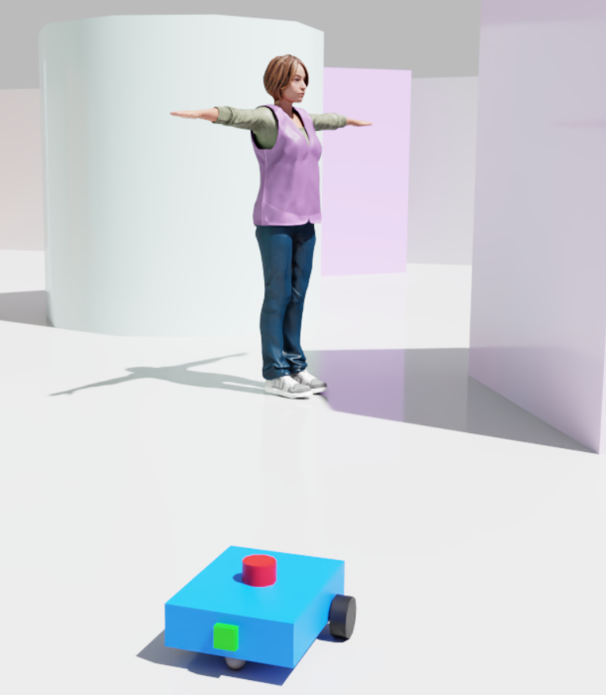

**One world from above.** A generated world paused mid-run: four rooms, doors in
the partition walls, seeded furniture and three people on their routes.

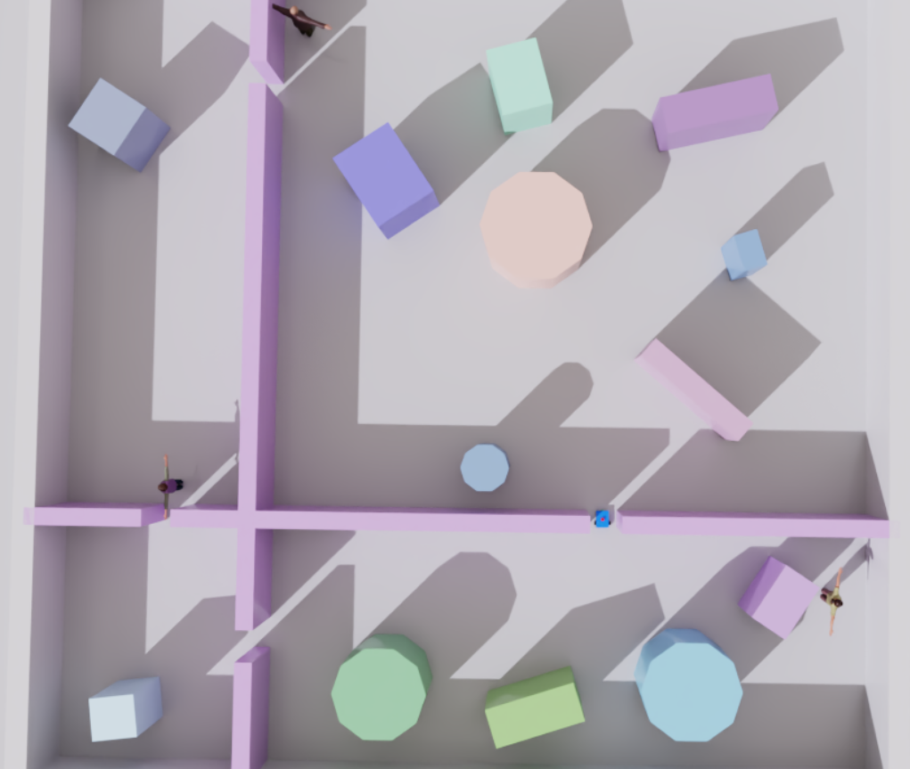

## Early exploration

**Single-run trajectory, open layout with narrow gates.** The reactive navigator's
path through an early generated world without partition walls, where narrow corridor
gates stand in for doors. Trajectories like this are the raw material every later
metric is computed from.
(`plot_run.py`)

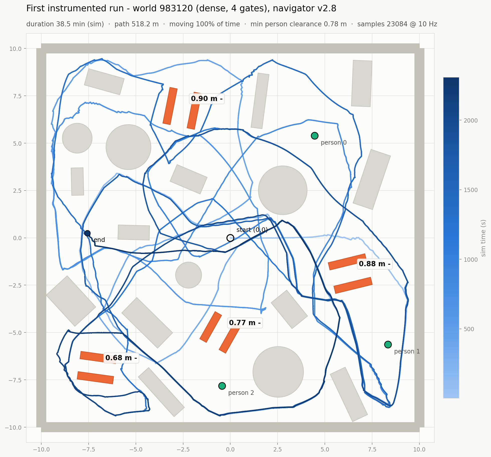

**Trajectory across rooms.** An early two-room world: a check that the navigator
actually crosses doors instead of orbiting one room.
(`plot_run2.py`)

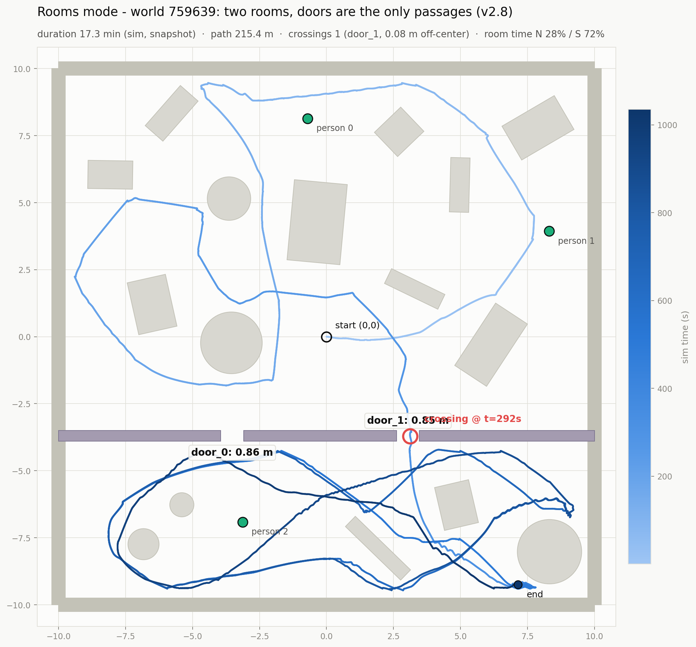

## Experiment 1: reactive navigation vs door width

**The success curve.** 25 worlds, 100 labeled doors, 38 of them approached. The
robot crossed 12 of 14 approached doors between 0.80 and 0.95 m, 10 of 17 between
0.66 and 0.80 m, and 2 of 7 below 0.66 m. The counts per bin are small, so the error
bars (Wilson 95% intervals) are wide. The dashed line marks the 0.42 m robot width,
the dotted line the 0.66 m nominal minimum (width plus 0.12 m inflation on each
side). (`plot_curve.py`, counts from `analyze_batch.py`)

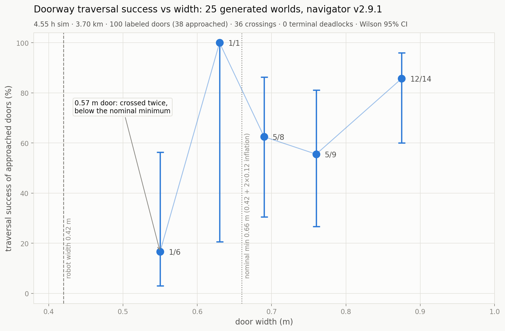

**Why version 2 exists.** The v1 baseline reached a terminal deadlock in all 25
worlds (median onset 24 s), and v2.9.1 in none. Same worlds, same seeds, and only the
navigator changed. (`plot_compare.py`, stats from `compare_v1_v2.py`)

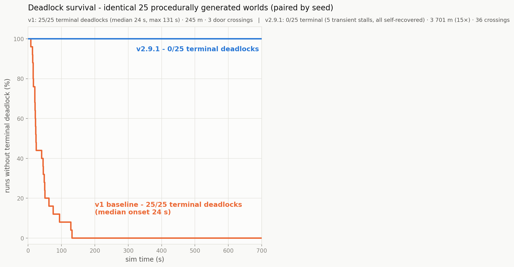

**Before and after, one world.** Seed 013 side by side: v1 stops for good after
16 s and 4.7 m, v2.9.1 covers 162 m and crosses doors five times, including the
0.57 m one, the narrowest door crossed in the batch. (`plot_before_after.py`)

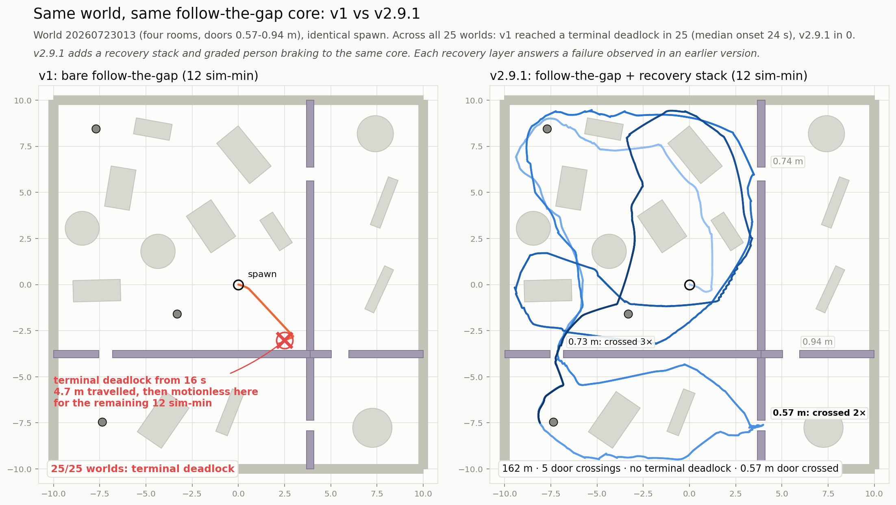

## Experiment 2: the cost of walking people

**One run among walking people.** World 192691, 79 simulated minutes with three
walkers: the robot's trajectory, the people's paths, and the distance from the robot
to the nearest person over time (centre to centre), with the closest pass marked.
(`plot_dynamic.py`)

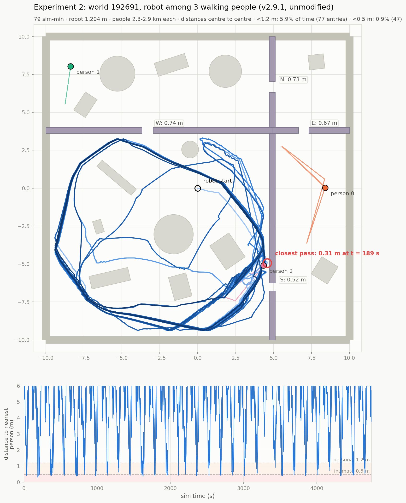

**The first dynamic batch.** 25 worlds with walking people, compared with the static
runs: speed unchanged, no terminal deadlock, walkers shoved the robot in at least 7 runs, and
the forensics of the 16 runs the first watchdog killed (all of them were moving). The
experiment 2 results use the second, full-length batch below.
(`plot_cost_of_dynamics.py`)

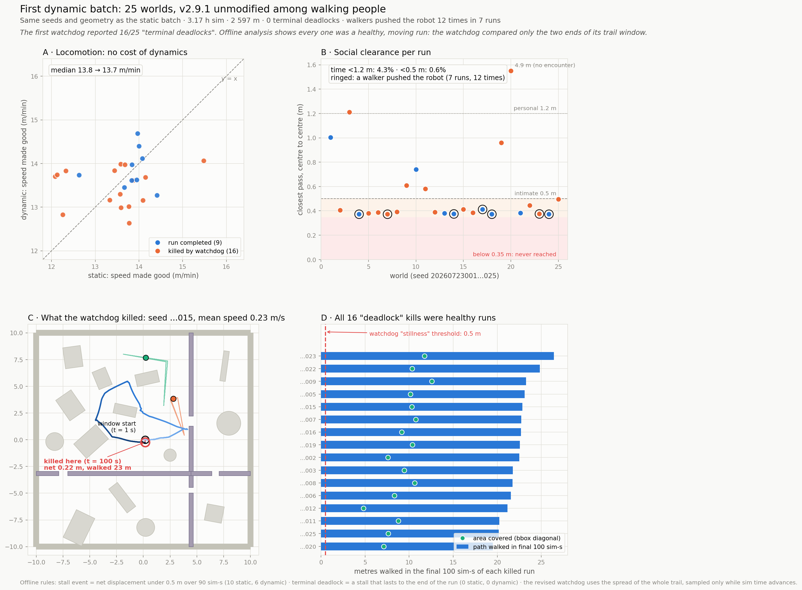

**The experiment 2 figure.** The second dynamic batch: speed seed by seed, closest
pass per run (median 0.41 m, never below 0.38 m, centre to centre, ringed where a
walker pushed the robot), door crossings by width, and the watchdog field test
(16 false kills before the fix, 0 after). (`plot_phase2_final.py`)

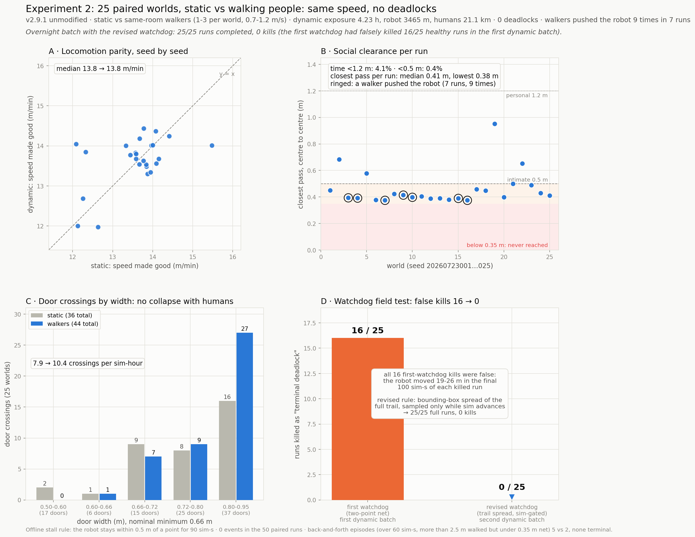

**Contested doorways.** One walker per world is routed through a door to a
neighbouring room (the widest one with a clear route). Encounters at that door go
from 26 to 54, the robot keeps using it (17 crossings in both conditions), and
walkers shove the robot in at least 12 of 25 runs. Panel C
shows the closest pass of the 75 runs: the walker comes up behind the robot at a
0.67 m door and pushes it 3 m. (`plot_xroom.py`)

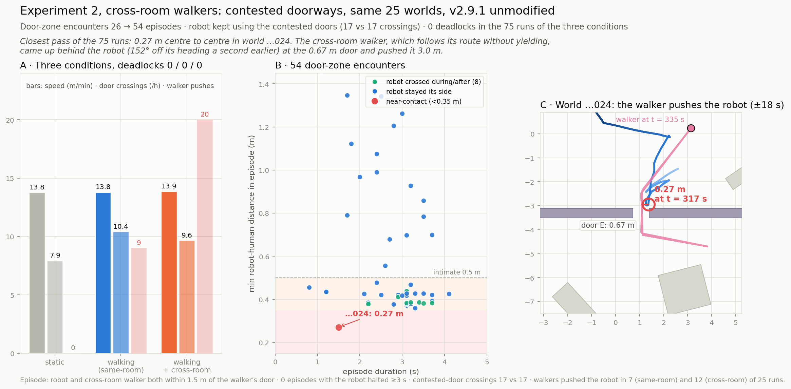

## Experiment 3: mapping while people walk

**The mapping batch.** All 25 worlds mapped autonomously in one unattended session. Grey is
the mapped occupancy, red the manifest ground truth, and the label the
wall-surface coverage. Median 63%, range 47–92%. (`plot_slam_batch.py`)

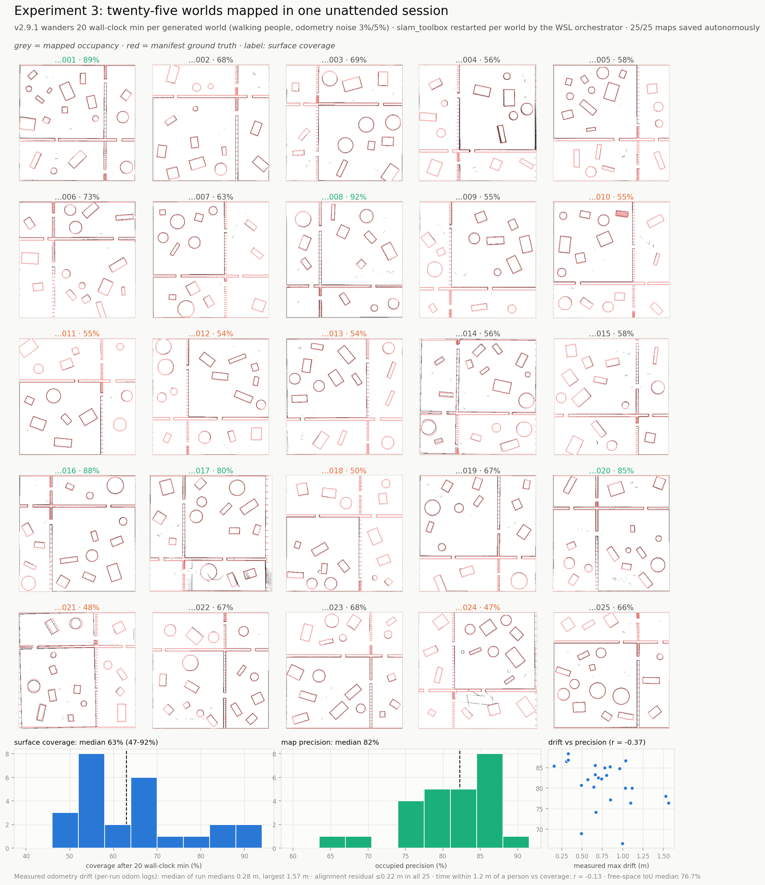

**Walking vs frozen people, one world.** The same world mapped twice. With the
people frozen in place, the map records each of them as an obstacle (the small
circles in panel B). With the people walking, slam_toolbox clears them almost
completely: 46 phantom cells on their paths, about 0.1 m². (`compare_maps.py`)

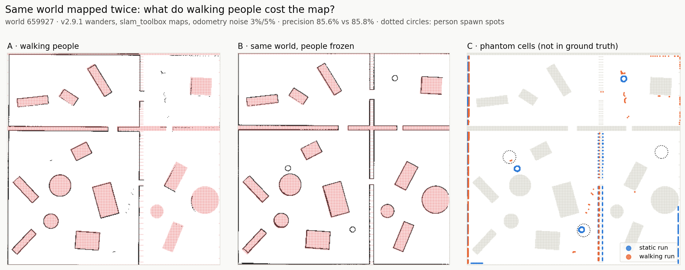

**Odometry-noise ablation, one world.** Four mapping runs at three noise tiers
(0/0 twice, 3%/5%, 8%/10%): occupied precision stays within 2.0 points (85.6-87.6%)
with no trend in the noise level, also in the run with up to 7.2 m of measured raw
drift. Coverage varies more, with the route each run happened to take.
(`plot_ablation.py`)

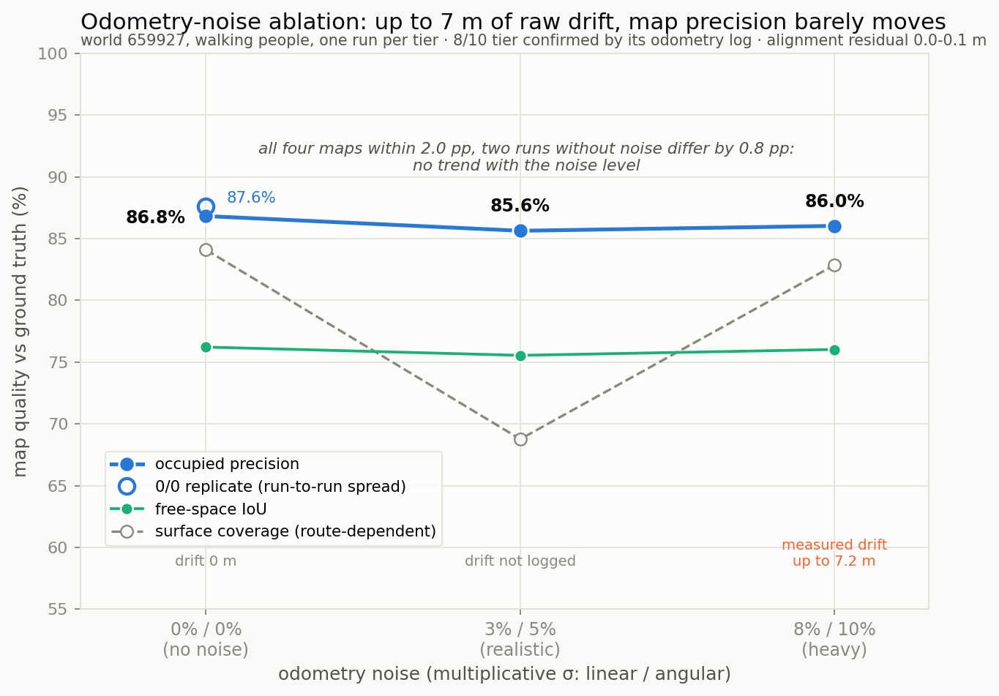

**Map-vs-truth evaluation, one world.** The overlay behind the map metrics: mapped
occupancy (grey) against the manifest geometry (red). `evaluate_map.py` also prints
occupied precision, surface coverage, free-space IoU and a per-room breakdown.

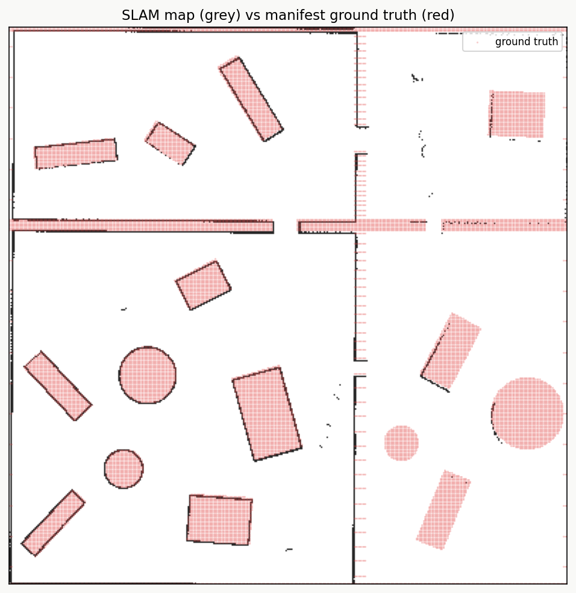

## Experiments 4 and 5: missions on self-built maps

**The paired mission matrices.** 25 worlds × 4 goals, baseline AMCL (v8, left) vs
AMCL tuned for sparse maps (v9, right), every cell checked against ground truth.
Dotted cells: goals the offline reachability check calls infeasible on that map.
In the checked tours false arrivals go 6 → 0 and real arrivals 11 → 12, and the
four worlds the check calls cages refused every cross-room goal in both
configurations. World 007 of the v9 run has no matching ground-truth log and is
excluded, although its tour reported all four goals within 4.3 s, which cannot be
real. (`plot_paired_missions.py`)

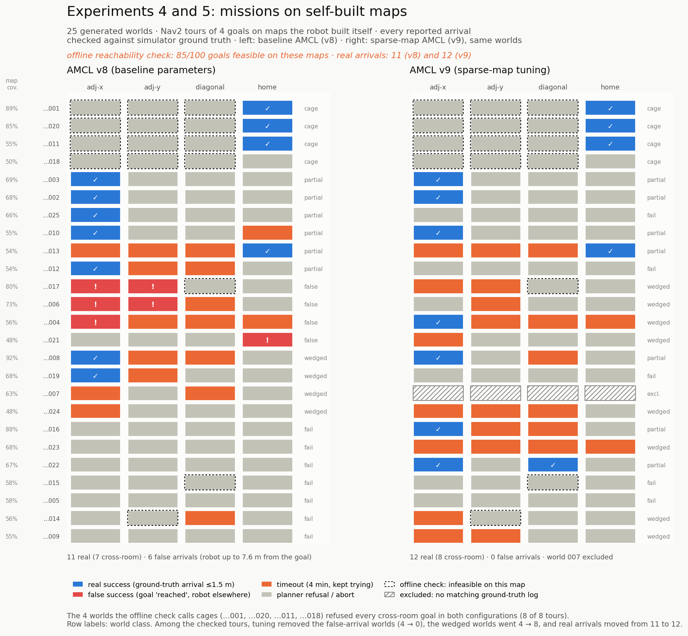
